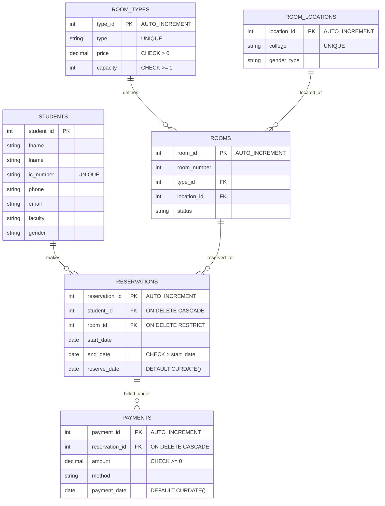

# Hostel Room Reservation System 🏨

[](https://www.mysql.com/)
[-red.svg)](#)
[](https://www.youtube.com/watch?v=5RZ2GprYfH0)

Welcome to the **Hostel Room Reservation System** database repository. This project was developed as part of the **Database Programming (SECP3623) Course (Section 02)** for Semester 01 2025/2026 at Universiti Teknologi Malaysia (UTM).

---

## 📖 Project Overview

Managing hostel room bookings is a critical task for university administrations. Historically, manual or fragmented booking systems led to registration errors, room double-bookings, payment mismatches, and overall confusion for both students and staff.

This project implements a robust relational database backend tailored for **Hostel Room Reservation Systems**. It provides a clean, normalized structure to track students, room specifications, locations, reservations, and payment states safely, preventing duplication and ensuring referential integrity.

### Key Objectives
1. **Hostel Administration**: Manage student registrations, check room availability, assign rooms by gender college policies, and track payment status.
2. **Referential Integrity & Constraints**: Apply strict Primary Keys, Foreign Keys, uniqueness rules, check constraints (e.g., end date > start date, positive pricing), and automated default timestamps.
3. **Advanced Querying**: Demonstrate comprehensive Data Query Language (DQL) queries including aggregations, grouping with filtering (`HAVING`), subqueries (single, multi-row, correlated), set operations, and complex joins.
4. **Performance Tuning**: Analyze and optimize queries using B-Tree and Full-Text indexing, verifying performance gains using `EXPLAIN ANALYZE`.

---

## 👥 Team Members & Roles

Our project was built through collaborative group efforts. The responsibilities were divided as follows:

| Name | Matric No. | Role & Contribution |
| :--- | :---: | :--- |
| **Muhammad Afiq Danish bin Mohd Hazni** | A23CS0118 | **Database Designer (DDL)**: Designed the schema structure, constraints, and relationships. |
| **Dheshieghan A/L Saravana Moorthy** | A23CS0072 | **Data Manipulation & Query Developer (DML + DQL)**: Populated database mock data and constructed initial queries. |
| **Muhammad Syahmi Faris bin Rusli** | A23CS0138 | **Query Specialist (DQL)**: Developed advanced retrieval scripts, subqueries, conditional logic, and set operations. |
| **Pravinraj A/L Sivabathi** | A23CS0171 | **Indexing & Optimization Analyst**: Profiled queries using explain analyze and added performance indexes. |

*🎬 **Watch our Group Presentation Video here:** [Hostel Room Reservation System - Presentation Video](https://www.youtube.com/watch?v=5RZ2GprYfH0)*

---

## 📂 Repository Structure

```
database-programming/
├── docs/
│   └── SyahmiFaris_Group4_ProjectI.pdf         # Complete project report and documentation
├── sql/
│   └── Afiq_dhesh_syahmi_pravin_project1.sql   # SQL source code (DDL, DML, DQL, Indexing)
└── README.md                                   # Project guide and explanation (This file)
```

---

## 📊 Database Schema Design

The database contains **6 core tables** designed to keep data normalized and minimize redundancies:



### Table Definitions

1. **`students`**: Stores basic information of registered students (including IC number, phone, email, faculty, and gender).
2. **`room_types`**: Configures various room categories (e.g., Single, Double, Deluxe) along with pricing rules and capacity thresholds.
3. **`room_locations`**: Defines hostel colleges (e.g., Alpha College, Beta College) and designates them to specific student genders (`Male`/`Female`).
4. **`rooms`**: Represents physical hostel rooms, mapping each to its type, location (college), and status (`Available`/`Occupied`).
5. **`reservations`**: Tracks reservation transactions mapping a student to a room for a designated time window.
6. **`payments`**: Handles billing records for active reservations, supporting FPX, Card, Cash, and other payment methods.

---

## ⚡ SQL Implementation Summary

The full implementation script is located in [`sql/Afiq_dhesh_syahmi_pravin_project1.sql`](file:///c:/Users/USER/.gemini/antigravity/scratch/database-programming/sql/Afiq_dhesh_syahmi_pravin_project1.sql).

### 1. Data Definition Language (DDL)
Includes creation of the database (`project_group4`), table schemas, constraints, and cascading actions:
* **Foreign Keys**: Configured with actions such as `ON DELETE CASCADE` on reservations and payments to maintain references, and `ON DELETE RESTRICT` on rooms to prevent critical data loss.
* **Alteration**: Demonstrates resetting foreign keys and changing constraints safely:
  ```sql
  ALTER TABLE rooms DROP FOREIGN KEY fk_location_id;
  ALTER TABLE rooms ADD CONSTRAINT fk_location_id
      FOREIGN KEY(location_id) REFERENCES room_locations(location_id) ON DELETE SET NULL ON UPDATE CASCADE;
  ```

### 2. Data Manipulation Language (DML)
Includes seed data ingestion (10 sample records per table), updates simulating active systems, and conditional deletions:
* **Update Example**: Modifying student profiles and changing room occupancy statuses:
  ```sql
  UPDATE rooms SET status = 'Occupied' WHERE room_id IN (101, 108);
  ```
* **Delete Example**: Removing expired reservations safely while turning off safe updates temporarily when required:
  ```sql
  SET SQL_SAFE_UPDATES = 0;
  DELETE FROM reservations WHERE end_date < '2025-12-15';
  SET SQL_SAFE_UPDATES = 1;
  ```

### 3. Data Query Language (DQL)
Demonstrates retrieval techniques covering all database programming requirements:
* **Filtering & Sorting**: Using compound operators and limits (e.g., top 5 most expensive rooms).
* **Aggregations & Grouping**: Extracting total revenues, counting students by faculty, and identifying colleges hosting multiple rooms using `HAVING`.
* **String & Numeric Functions**: Utilizing `CONCAT`, `UPPER`, `LENGTH`, `SUBSTR`, `ROUND`, and `TRUNCATE` in a unified query:
  ```sql
  SELECT 
      CONCAT(fname, ' ', lname) AS full_name,
      UPPER(faculty) AS faculty_uppercase,
      LENGTH(email) AS email_length,
      SUBSTR(fname, 1, 3) AS fname_3letters,
      ROUND(rt.price) AS rounded_price
  FROM students s ...
  ```
* **Conditional Logic**: Utilizing `CASE WHEN` to categorize student records dynamically.
* **Subqueries & Set Operations**: Showcasing single-row, multi-row, and correlated subqueries (`EXISTS`/`NOT EXISTS`), and joining sets with `UNION`.
* **Joins**: Utilizing `NATURAL JOIN`, `INNER JOIN` (to connect reservations with student details), `LEFT OUTER JOIN` (to report all rooms including unreserved ones), and `SELF JOIN` (to match rooms sharing the same category).

---

## 📈 Optimization & Performance Tuning

To optimize data access paths as the database scales, we set up performance profiling:

### 1. B-Tree Index on Price
* **Target Query**: Finding rooms with a nightly price higher than a threshold.
  ```sql
  SELECT rm.room_number, rt.type, rt.price 
  FROM rooms rm JOIN room_types rt ON rm.type_id = rt.type_id
  WHERE rt.price > 200.00;
  ```
* **Index Created**:
  ```sql
  CREATE INDEX idx_price_btree ON room_types(price);
  ```
* **Analysis**: Profiling with `EXPLAIN ANALYZE` showed that creating this B-Tree index allowed the optimizer to switch from a **Full Table Scan** to a **Range Scan**, dropping query cost from **4.75** to **2.42**.

### 2. Full-Text Index on College
* **Target Query**: Searching colleges matching text strings.
  ```sql
  SELECT rl.college, rm.room_number
  FROM room_locations rl JOIN rooms rm ON rl.location_id = rm.location_id
  WHERE rl.college LIKE '%College%';
  ```
* **Index Created**:
  ```sql
  CREATE FULLTEXT INDEX idx_college_fulltext ON room_locations(college);
  ```
* **Optimized Query**:
  ```sql
  SELECT rl.college, rm.room_number
  FROM room_locations rl JOIN rooms rm ON rl.location_id = rm.location_id
  WHERE MATCH(rl.college) AGAINST ('College' IN NATURAL LANGUAGE MODE);
  ```
* **Analysis**: By matching keyword tokens rather than searching character-by-character with standard `LIKE` wildcards, execution cost dropped significantly to **0.7**.

---

## 🎓 Conclusion

This project successfully builds a complete relational model for hostel room reservations. By planning normalization layers and establishing strict checks, we prevented data anomalies. Additionally, through performance profiling using index tuning, the system demonstrated scalable query latencies suitable for production workloads.